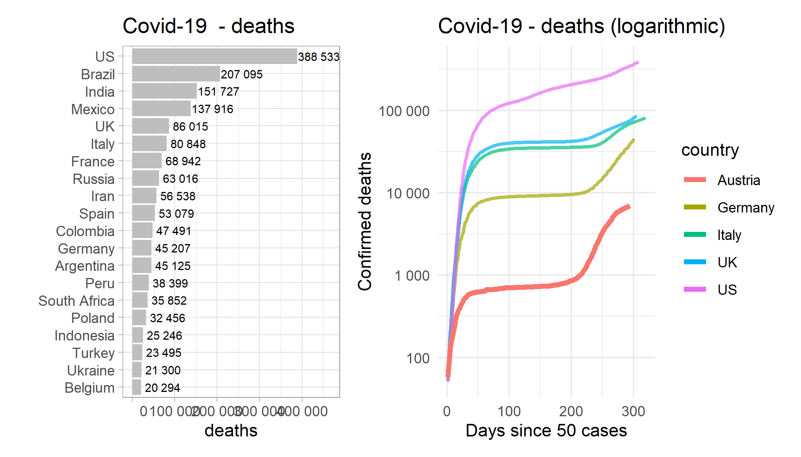
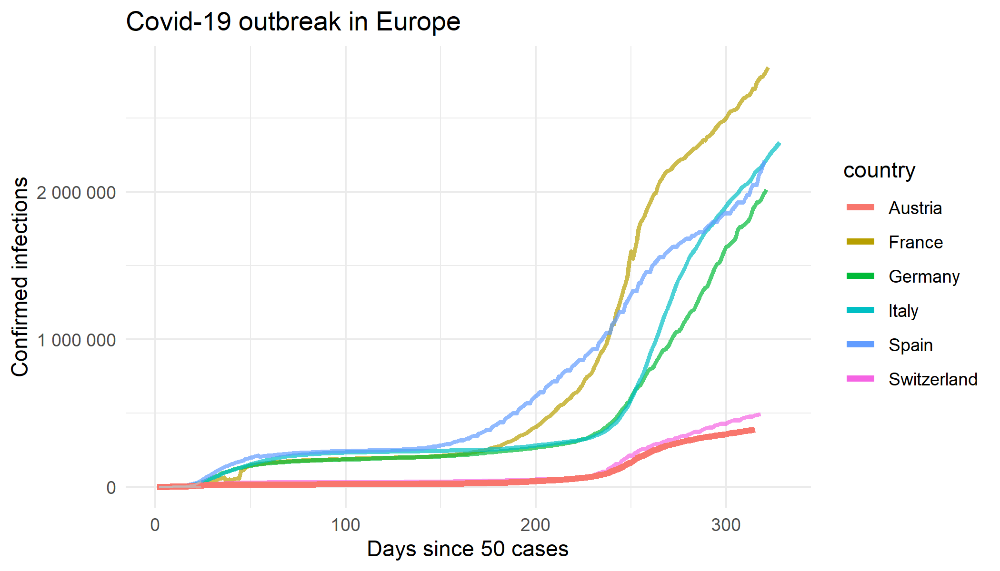

# Covid-19 Outbreak in Austria

**This COVID-19 analysis is for educational purpose!**

Data based on *2019 Novel Coronavirus COVID-19 (2019-nCoV) Data Repository by Johns Hopkins*
CSSE (https://github.com/CSSEGISandData/COVID-19)

Confirmed Infections are biased (availability of tests, numer of tests per day, test strategy, reporting strategy). The real number of infections may be much higher than confirmed cases due to unreported cases. Furthermore there are signifikant differences between countries regarding social behavior (bowing, handshaking, kissing), family structure, timing of social distancing, complience of people etc.







# Covid-19 R-Code Toolbox

You can use this toolbox to explore Covid-19 with R-Code:

```R
# use toolbox
source("covid-19-toolbox.R")

# confirmed
confirmed <- covid19_read_confirmed()

confirmed %>% 
  covid19_plot_confirmed(
    countries = c("Austria","Italy","China/Hubei"),
    highlight_country = "Austria",
    log = FALSE,
    min_confirmed = 100
  )

confirmed %>% 
  covid19_plot_szenarios(country = "Spain")
  
confirmed %>% 
  covid19_plot_daily_growth(country = "Austria")

confirmed %>% 
  covid19_plot_overview("US")

# deaths
deaths <- covid19_read_deaths()

deaths %>% 
  covid19_plot_deaths_ranking()

deaths %>% 
  covid19_plot_deaths(countries = c("Austria","Germany"))

# combine confirmed + deaths + recovered
confirmed <- covid19_read_confirmed()
deaths <- covid19_read_deaths()
recovered <- covid19_read_recovered()

data <- covid19_combine_data(confirmed, deaths, recovered)

data %>% covid19_show_death_rate()
```

You may need to install the following R-packages:

```R
install.packages(c("tidyverse", "lubridate", "scales")
```

# Additional Covid-19 Links

Data / Visualisation: 
* https://coronavirus.jhu.edu/map.html (World)
* https://ncov2019.live/data (World / US)
* https://orf.at/corona/daten (Austria)
* https://www.addendum.org/coronavirus/oesterreich-verbreitung/ (Austria)

Background:
* https://de.wikipedia.org/wiki/COVID-19-Pandemie_in_%C3%96sterreich
* https://de.wikipedia.org/wiki/COVID-19

Szenarios:
* https://medium.com/@tomaspueyo/coronavirus-the-hammer-and-the-dance-be9337092b56
* https://medium.com/tomas-pueyo/coronavirus-der-hammer-und-der-tanz-abf9015cb2af

R Code:
* https://towardsdatascience.com/top-5-r-resources-on-covid-19-coronavirus-1d4c8df6d85f
* https://staff.math.su.se/hoehle/blog/2020/03/16/flatteningthecurve.html
* https://rviews.rstudio.com/2020/03/19/simulating-covid-19-interventions-with-r/
* https://cran.r-project.org/web/packages/coronavirus/index.html
